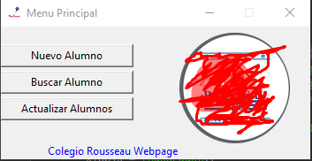
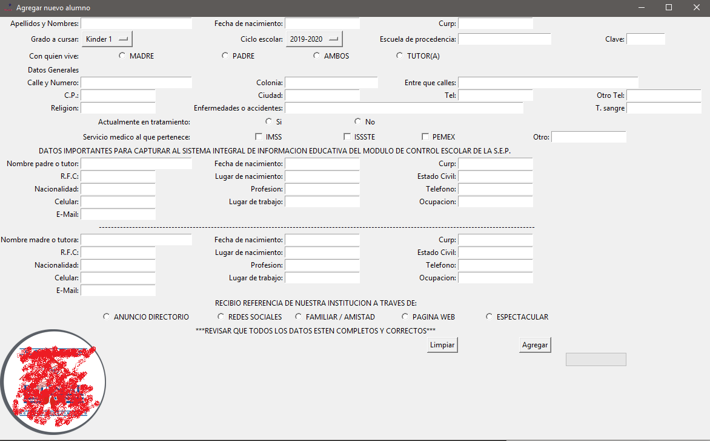

# RousseauStudents
Full tkinter and openpyxl program code with python 3.7

This program was developed with tkinter, openpyxl and python 3.7. If you are looking for a multi windows tkinter code with excel (openpyxl) integration, login, labels, hyperlinks, lists, entries, checkboxes, radiobuttons, buttons, images, icons, messagebox, etc. This could be a good example for you. :)

Login

Main Menu

Add User

Excel result of adding a user

Search User

